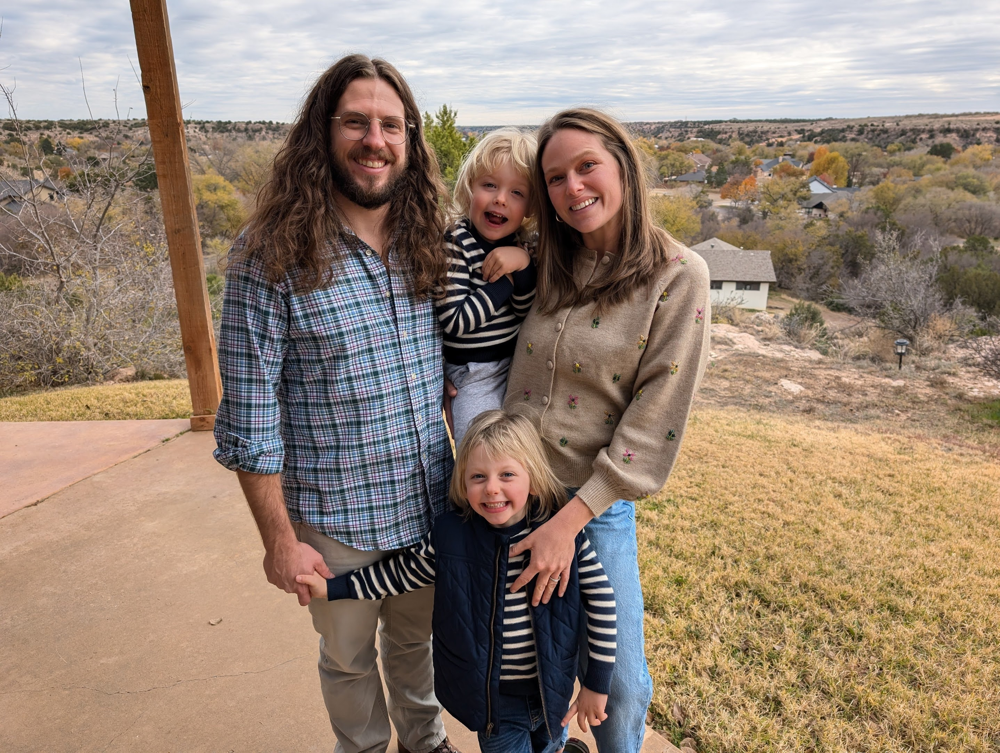

---
title:  'about'
lang: en
keywords: [demo, pandoc, static site]
...

Hello! My name is Brandon James. I am a PKI engineer, working for Fastly[^1] and living in Fort Collins, CO. My professional background includes network security, enterprise and data center networking, automation, virtualization, storage, servers and a bit of desktop support. Prior to Fastly, I worked as a Network Security Engineer at Meta and held Network Engineering roles at Meta, GM Financial and CoNetrix Technologies. I also hold a Bachelors in Economics from Texas Tech University, with a minor in Computer Science and a Masters of Science in Computer Science from Arizona State University. I'm a lifelong techie and try to take the classic hacker approach to computing. That is computing in a playful manner. 

Outside of tech, I'm a father, husband, dog owner, trail runner, cyclist and wannabe landscape/wildlife photographer. There was a point in my life where I had a web presence for all my hobbys, but that day is gone and I'm happy to keep it that way.

[^1]: Any options expressed here are solely my own and do not reflect the position or policy of my employer.
