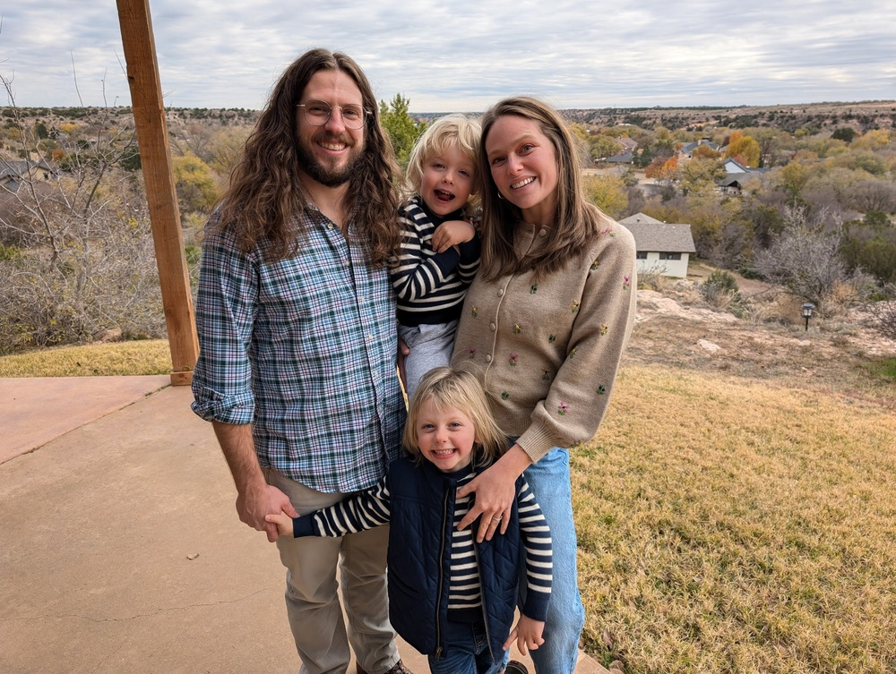

---
title:  'about'
lang: en
keywords: [demo, pandoc, static site]
...

Hello! My name is Brandon James. I am a network security engineer, working for meta[^1] and living in Fort Collins, CO. My professional background includes enterprise and data center networking, automation, virtualization, storage, servers and a bit of desktop support. I'm a lifelong techie and try to take the classic hacker approach to computing. That is computing in a playful manner. 

Outside of tech, I'm a father, husband, dog owner, trail runner and wannabe landscape/wildlife photographer. There was a point in my life where I had a web presence for all my hobbys, but that day is gone and I'm happy to keep it that way.

[^1]: Any options expressed here are solely my own and do not reflect the position or policy of my employer.