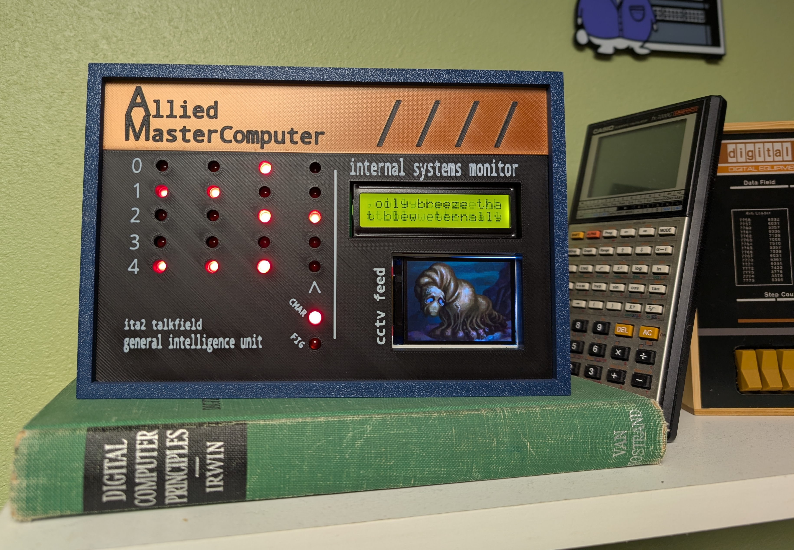
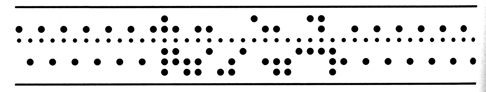
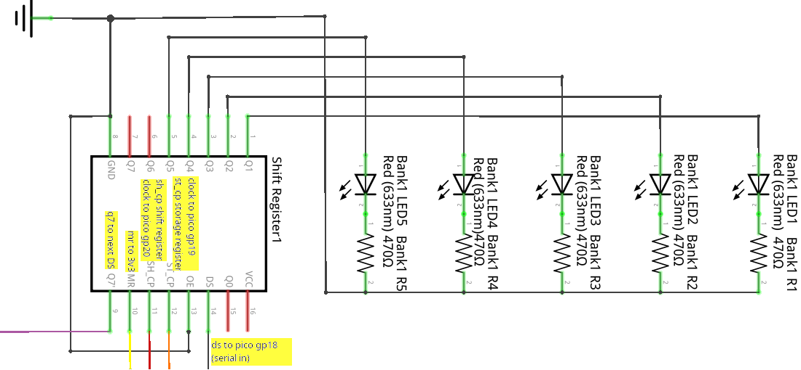
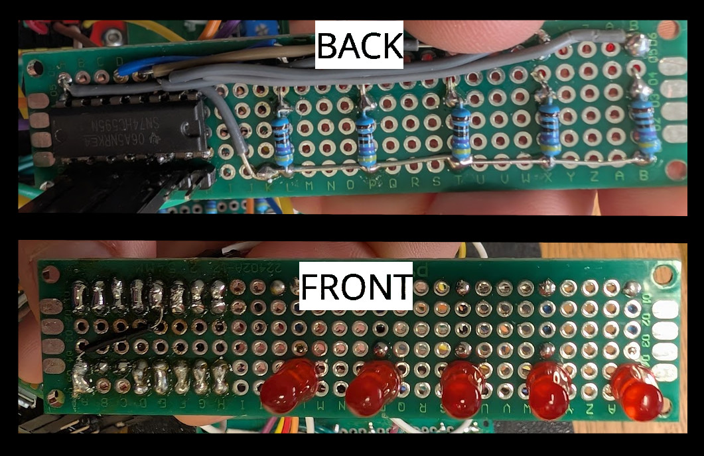
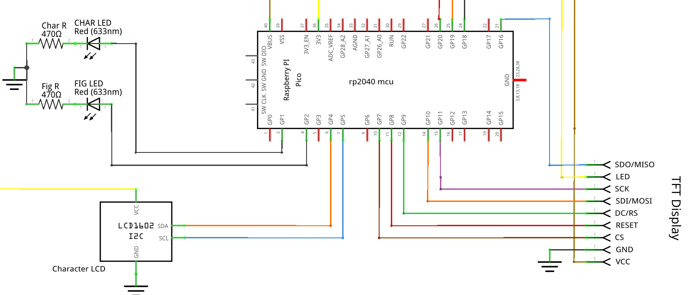
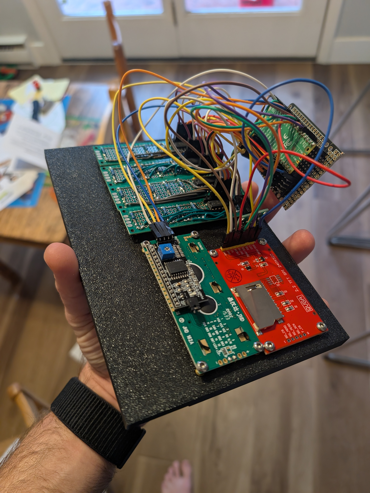
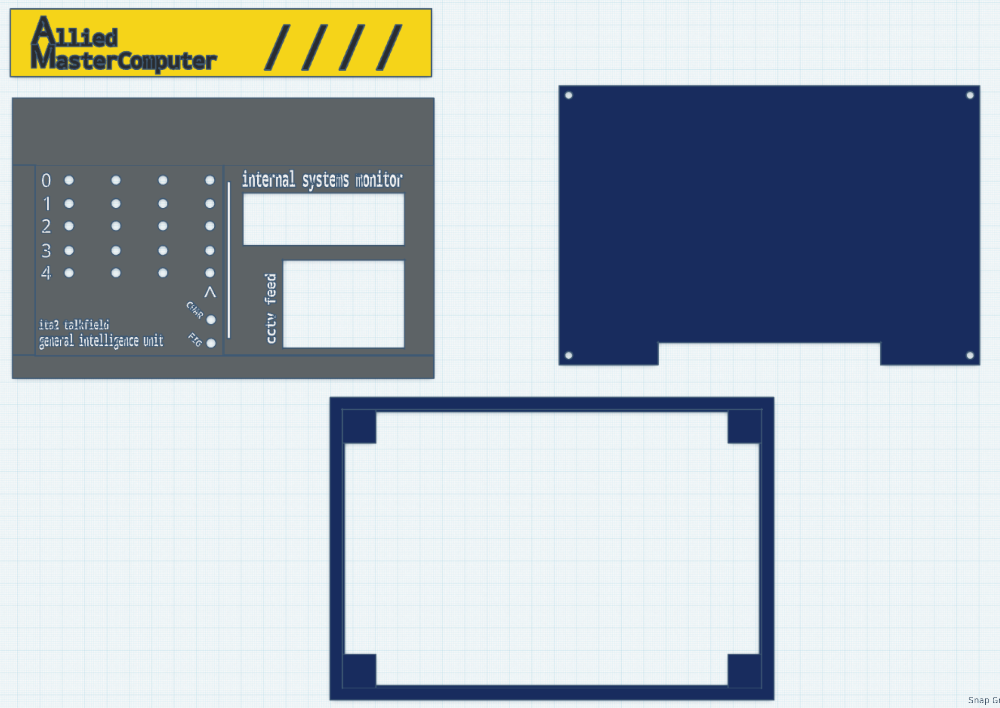
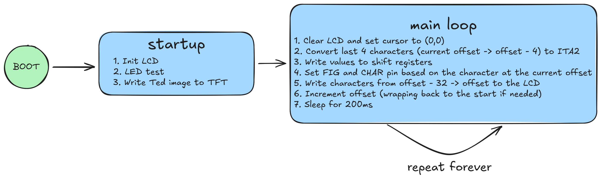
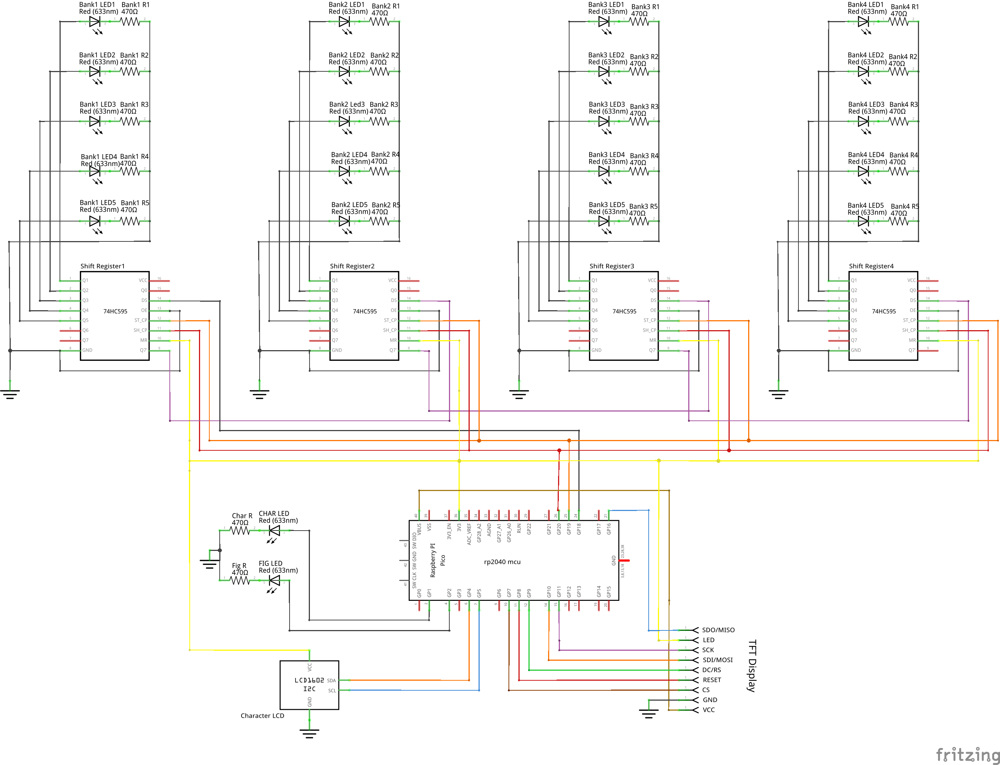

Last Halloween, I had just wrapped up my MCS coursework and wasn't quite ready to finalize my project portfolio, so I decided to celebrate by switching gears and building something at the intersection of hardware and software. A decoration with its basis in a horror story seemed to fit. I chose to base this project on "I Have No Mouth and I Must Scream" by Harlan Ellison. Since it's a short story, I knew it wouldn't take long to re-read and it fits well with my love for the retro computing **A E S T H E T I C**. 

[](media/am.webm){target="_blank"}
<center>*click to open a video in a new tab*</center>

In "I Have No Mouth and I Must Scream", five humans are tormented by an evil sentient computer named AM (Allied Mastercomputer _or later_ Aggressive Menace). The story is narrated by Ted, the last survivor of this group. For this project, I wanted to build something that might resemble AM's control panel, ultimately stealing design cues from the [Altair 8800](https://en.wikipedia.org/wiki/Altair_8800).

# Designing the Control Panel

I had particular pieces of the story I wanted to capture. These components, along with how I brought them into the physical world are outlined in the following sections.

## AM's "Talkfields"

Throughout the story, Ellison periodically uses [ITA2 Baudot-Murray](https://en.wikipedia.org/wiki/Baudot_code#ITA2) encoded messages to show what AM is thinking. These look like the following[^1]:



ITA2 is a simple 5-bit encoding scheme that supports uppercase letters, digits and a set of figures. It was used for telegraphy and has it's origins in the earlier [Baudot Code](https://en.wikipedia.org/wiki/Baudot_code) invented by [Émile Baudot](https://en.wikipedia.org/wiki/%C3%89mile_Baudot) in the 1870s. 

In the above image, you might notice there appears to be six bits instead of five, the "bit" that is represented as a smaller circle than the others is actually a hole used to feed the paper as the teleprint machine outputs the received message. In order to incorporate this component in my design, I opted to display four characters using four sets of five LEDs and an additional set of two LEDs denoting whether a specific character was to be interpreted as a figure or character. 

A partial schematic zoomed in on an individual character array follows (full schematic [here](#schematic)):



The individual components for each talkfield character consist of one shift register, five LEDs and five resistors. Each character's shift register is chained to the next character's shift register's serial (DS) input, except the first shift register, which is connected to GP18 on the Pico MCU. ST_CP and SH_CP on all shift registers are connected to GP19 and GP20. This configuration allows all 20 LEDs to be individually controlled using only three GPIO pins. 



I'll talk about the code to control the array's in the software section. It is worth noting here, that I have the talkfield set up to output the entire short story, not only the parts shown as talkfields in printed copies. 

## Character and TFT Displays

The unit also has two additional displays, a traditional 16 character by 2 row LCD and a TFT display. The 16 character display outputs the full text of the story in lock step with the talkfield. The TFT display adds a bit of spookiness by showing Ted in his mouthless final form from the [1995 video game adaptation](https://i-have-no-mouth-and-i-must-scream.fandom.com/wiki/Ted?file=Ted+game+jelly.png). I'll cover how I interact with these a little more in the software section, although I didn't really do anything special here. I just found the C++ libraries in platform io and followed their documentation.

A partial schematic zoomed in on the displays follows (full schematic [here](#schematic)):



The TFT display chews up quite a few GPIO pins!

## Electronics overview



## Case Design

The case itself is made up of four total parts:

1. The case body
2. The back panel
3. The front panel
4. The front badge

These are largely press fit components with the exception of the backpanel, where I used some melt-in M3 nuts and bolts. The parts were all printed on my Bambu P1S. 



The case was designed in tinkercad, because I've been putting off learning a proper CAD program and tinkercad is sufficient when you're just nesting a bunch of rectangles anyways. You can download the files [here](https://www.tinkercad.com/things/j3Q7p1mBGgp-am?sharecode=cCppnE3u_uwc51jNL6oadzl-hfIOV1R0l8gZ8gGM8h0) if interested. 

# Software

The code itself is very simple ([github](https://github.com/bjames/AM)), it effectively runs an initialization function and then enters an endless loop. 



Due to the rp2040's limited flash and the need to store the entire short story and an image, I decided to use C++ and Platform IO (circuit python is the alternative and it's firmware takes up a lot of space). It was nice writing C++ for the first time in a few years. I will say this was a fairly simple project from a software perspective **and** Platform IO made it very easy to find libraries to handle all the legwork of dealing with displays and shift registers. The project is structured as follows:

```
AM
├── include
│   ├── nomouth.h -> Full text, edited to be ITA2 friendly
│   └── ted.h -> Ted's image converted to a C struct
├── platformio.ini -> Pulls in external libraries, handles build and upload
└── src
    └── main.cpp -> Program code
```

The platformio.ini pulls in the following libraries:

* [simsso/ShiftRegister74HC595](https://github.com/Simsso/ShiftRegister74HC595) - used to set shift register bits
* [johnrickman/LiquidCrystal_I2C](https://github.com/johnrickman/LiquidCrystal_I2C) - used to write text to the LCD
    * Note this library has changed maintainers, my platformio.ini specifies `marcoschwartz/LiquidCrystal_I2C@^1.1.4`
* [adafruit/Adafruit ILI9341](https://github.com/adafruit/Adafruit_ILI9341) - used to draw the image on the TFT display

The code to convert characters to ITA2 is just a giant switch statement. This worked well enough for my purposes. 

# Schematic




# Parts list

- Generic Red LEDs (x22)
- 470ohm Resistors (x22)
- 74HC595 Shift Registers (x4)
- Raspberry Pi Pico (RP2040)
- Generic 1602 LCD Character Display (16 characters x 2 rows)
- Generic ILI9341 TFT Display
- A fistfull of perfboards and headers

[^1]: w:Harlan Ellison, Public domain, via [Wikimedia Commons](https://commons.wikimedia.org/wiki/File:IHaveNoMouthAMTalkfield2.jpg)
