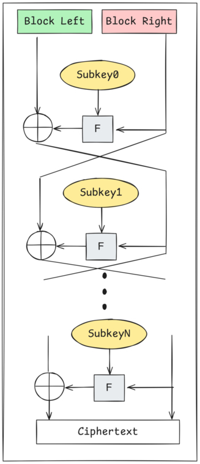
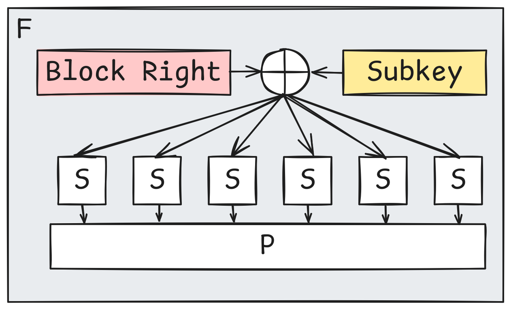
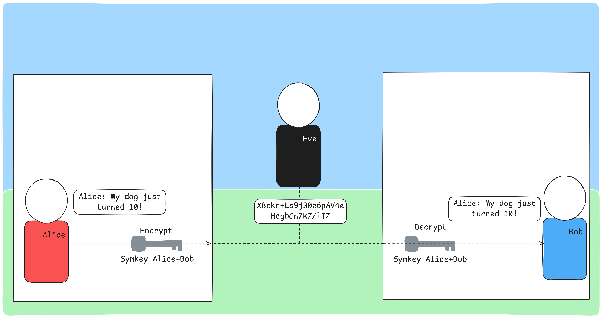
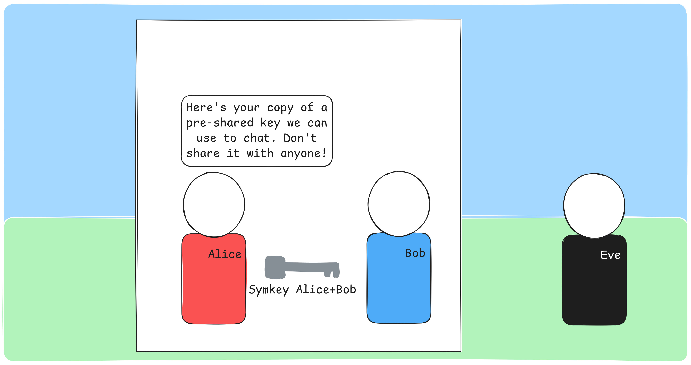
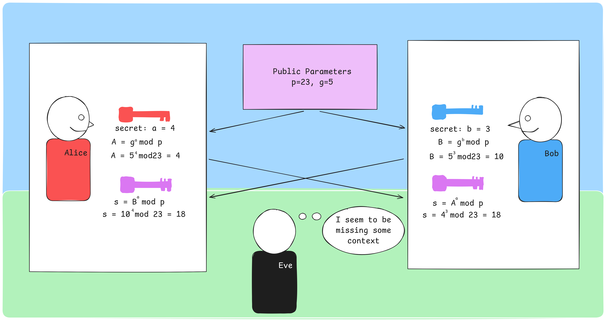
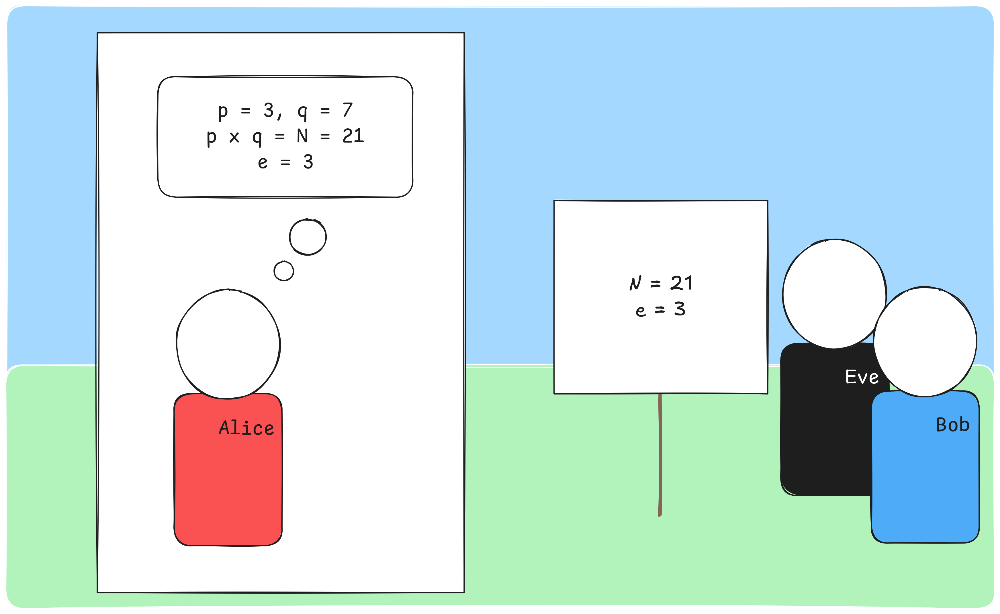
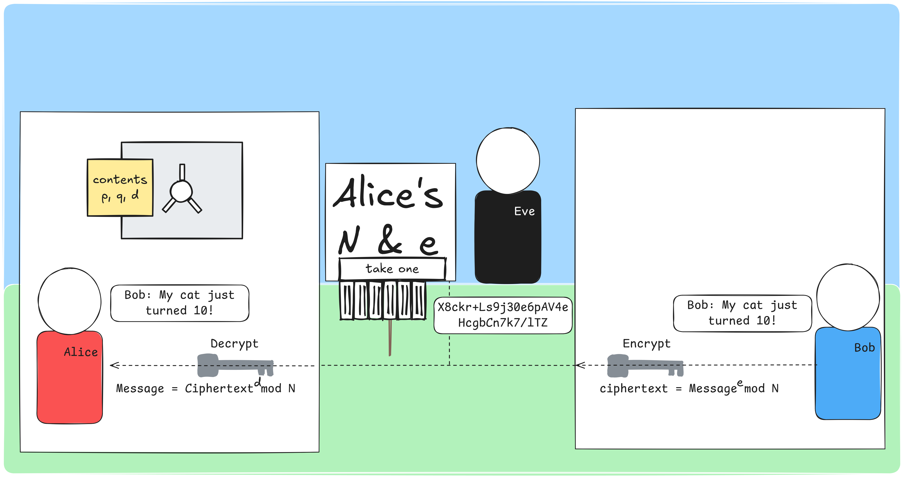
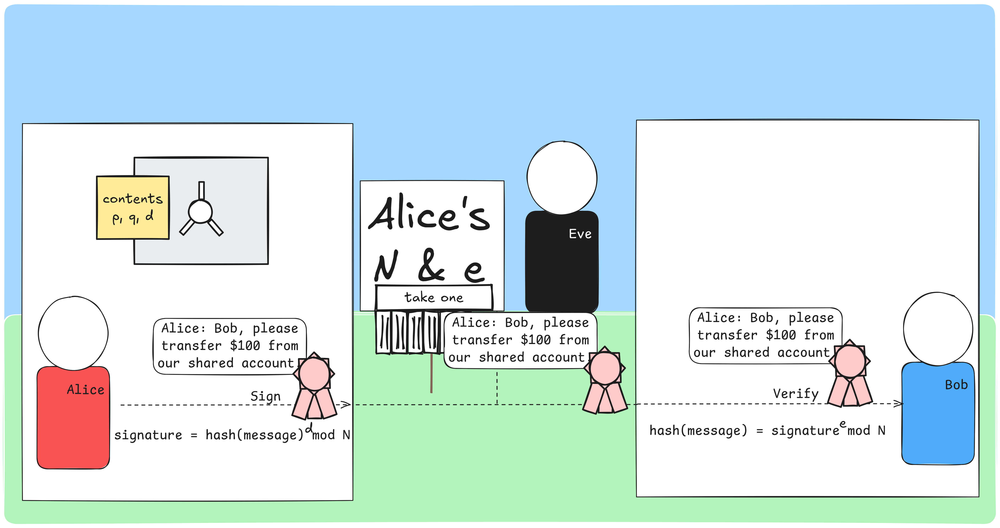
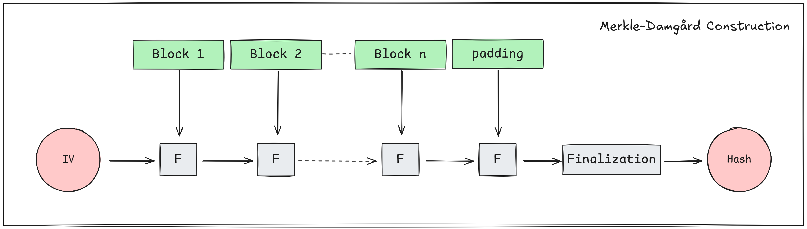
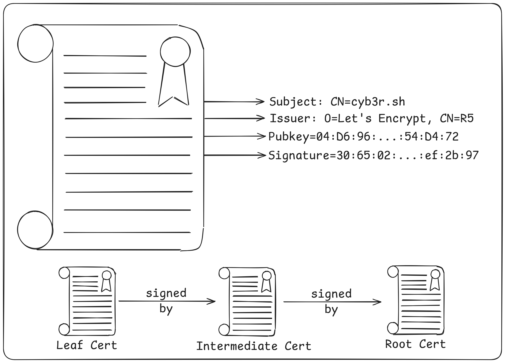

This post is an expanded version of a talk I gave at [NoCo Hackers](https://nocohackers.com/) in August 2025. The goal is to provide:

1. A basic overview of how modern cryptography works
2. Intuition for the math behind RSA
3. Working knowledge of how cryptographic protocols are used today
4. Basic knowledge about what TLS certificates are and how certificate chaining works

Many details will be left out in order to focus on broader concepts and the examples I use are "classic" concepts like RSA and DES as opposed to more recent innovations like ECDSA and AES. I also completely ignore post-quantum cryptography. I am not a cryptographer, but I apply many of these concepts in my day to day.

Each section includes hands-on exercises you can follow along with using standard linux utilities like `openssl`.

<details>
    <summary>Some exercises look like this. Click to expand.</summary>

    Click again to collapse. 
    
</details>

# Symmetric Encryption

Symmetric encryption uses a single key for both encryption and decryption. The implementation can vary quite a bit, but common algorithms include 3DES, Blowfish, AES and ChaCha20. If you work in tech, you've likely heard of some of these. Since you're on my website, you either used ChaCha20 or AES to load this page[^1].

While the concept sounds similar to substitution ciphers[^5] many of us used on the playground as kids, substitution ciphers are vulnerable to techniques like [frequency analysis](https://en.wikipedia.org/wiki/Frequency_analysis) and [known plaintext](https://en.wikipedia.org/wiki/Known-plaintext_attack) attacks. Modern symmetric encryption prevents these methods from working by scrambling the output in addition to performing substitution.

Just how secure are these algorithms? Using today's technology, 128-bit AES would take more than the current age of the universe to crack[^2]. 256-bit AES is likely quantum safe, assuming no new quantum algorithms produce speed-ups beyond that of Grover's algorithm[^3]. They are quite good, assuming you can securely manage your keys.

## Feistel Networks

Symmetric block ciphers such as DES and Blowfish are built on a structure called a Feistel network. An input block is split into left and right halves, and a round function _F_ is applied repeatedly with different subkeys derived from the main key. Each round mixes the data further, and after enough rounds, the output is effectively indistinguishable from random noise. 



In the DES round function, the right half of the block is XORed with a subkey, then passed through S-boxes that substitute chunks of bits (providing confusion - obscuring the relationship between key and ciphertext), followed by a permutation that rearranges the bit positions (providing diffusion - spreading each input bit's influence across the output).



Not all block ciphers are built on Feistel networks. For instance [AES](https://en.wikipedia.org/wiki/Advanced_Encryption_Standard) uses a much different architecture featuring a substitution-permutation network. The underlying idea is still the same. Take a block, substitute, permute and repeat. 

## Symmetric Encryption in Practice

In practice, Alice and Bob share a secret key. When Alice wants to send a message, she encrypts it with the shared key. The ciphertext travels across the network where Eve can see it, but without the key, it's just gibberish. Bob decrypts it with his copy of the same key.



<details>
<summary>Exercise: Symmetric Encryption with GPG</summary>

Let's encrypt and decrypt a file using GPG with AES-256. First, create a file to encrypt:

```
┌─(you@workshop)-[~/tls_workshop]
└─$ echo "In the realm of cryptographic lore,
Live three souls we all adore,
Alice sends her secrets bright,
Bob receives them in the night." > poem.txt
```

Encrypt the file with AES-256. You'll be prompted for a passphrase:

```
┌─(you@workshop)-[~/tls_workshop]
└─$ gpg --output poem.txt.enc --symmetric --cipher-algo AES256 poem.txt
```

Take a look at the encrypted file - it's unreadable:

```
┌─(you@workshop)-[~/tls_workshop]
└─$ more poem.txt.enc
c^L)poO^LM"6!=U,(o_WoMYG\uibz/?sg[ö_B21'OH_7|#@?)D2
```

We can verify it's actually AES-256 encrypted data:

```
┌─(you@workshop)-[~/tls_workshop]
└─$ file poem.txt.enc
poem.txt.enc: PGP symmetric key encrypted data - AES with 256-bit key salted & iterated - SHA512 .
```

Now decrypt it into a new file and verify the contents match:

```
┌─(you@workshop)-[~/tls_workshop]
└─$ gpg --output poem2.txt --decrypt poem.txt.enc
gpg: AES256.CFB encrypted data
gpg: encrypted with 1 passphrase
┌─(you@workshop)-[~/tls_workshop]
└─$ sha256sum poem.txt poem2.txt
421fa5b43f8cf383c66966c033343adc9c4cbba4119664d8c552713e806e7476  poem.txt
421fa5b43f8cf383c66966c033343adc9c4cbba4119664d8c552713e806e7476  poem2.txt
```

The SHA-256 hashes match - the decrypted file is identical to the original.

</details>

# The Key Distribution Problem

There's a fundamental issue with symmetric encryption: how do Alice and Bob agree on a shared key in the first place? If they can meet in person and exchange a key, great. But what if they're on opposite sides of the internet and have never communicated before?



They can't just send the key over the network in plaintext - Eve would intercept it. They need a way to agree on a shared secret over an insecure channel. Enter Diffie-Hellman.

# Diffie-Hellman Key Exchange

Diffie-Hellman allows two parties to establish a shared secret over an insecure channel. Here's how it works:

1. Alice and Bob agree on two public parameters: a large prime _p_ and a generator _g_
2. Alice picks a secret number _a_ and computes _A = g^a^ mod p_
3. Bob picks a secret number _b_ and computes _B = g^b^ mod p_
4. They exchange _A_ and _B_ publicly
5. Alice computes the shared secret: _s = B^a^ mod p_
6. Bob computes the shared secret: _s = A^b^ mod p_
7. Both arrive at the same value of _s_



A small example: with _p_ = 23 and _g_ = 5, if Alice picks _a_ = 4 and Bob picks _b_ = 3:

- Alice computes _A_ = 5^4^ mod 23 = 4
- Bob computes _B_ = 5^3^ mod 23 = 10
- Alice computes _s_ = 10^4^ mod 23 = 18
- Bob computes _s_ = 4^3^ mod 23 = 18

Both arrive at 18 without ever transmitting their secret values. Eve sees _p_, _g_, _A_ and _B_, but cannot efficiently compute _s_.

Some important notes on parameter selection: _p_ must be a prime number (2048-bit is the current best practice). _g_ should be a primitive root of _p_ (aka a generator). The choice of _a_ and _b_ are less important, but there are "weak" keys that should be avoided.

<details>
<summary>Exercise: Generate DH Parameters</summary>

Use OpenSSL to generate Diffie-Hellman parameters. This will take a moment as it needs to find a suitable large prime:

```
┌─(you@workshop)-[~]
└─$ openssl genpkey -algorithm dh -genparam -text
```

This outputs the DH parameters including the prime _p_ and generator _g_. In practice, these parameters are negotiated as part of the TLS handshake.

</details>

# Number Theory Notes - Why This Works

Diffie-Hellman works due to the Discrete Logarithm Problem:

- Given _g^k^ ≡ a (mod p)_, where you know _g_, _a_, and _p_, find _k_.
- When _p_ is a 2048-bit prime number and _g_ is a primitive root, this is currently out of the reach of even nation state actors.

## Modular Arithmetic

Modular arithmetic _is not_ intuitive. A few examples:

- 7 mod 5 = 2, 17 mod 5 = 2, and 22 mod 5 = 2
    - 7 ÷ 5 = 1 remainder **2**, 17 ÷ 5 = 3 remainder **2**, and 22 ÷ 5 = 4 remainder **2**
- In terms of modular arithmetic, we describe congruence relations _a ≡ b (mod m)_ as follows:
    - 7 ≡ 17 (mod 5) or 17 ≡ 22 (mod 5) because 7, 17 and 22 all equal 2 in terms of mod 5

Try it yourself:

<style>
.crypto-widget {
    background: var(--border-color);
    border: 1px solid var(--accent-color);
    border-radius: 4px;
    padding: 1em;
    margin: 1em 0;
}
.crypto-widget label {
    margin-right: 1em;
}
.crypto-widget input[type="number"] {
    width: 5em;
    padding: 0.3em;
    background: var(--background-color);
    color: var(--text-color);
    border: 1px solid var(--accent-color);
    border-radius: 3px;
    font-family: monospace;
    font-size: 1em;
}
.crypto-widget .widget-result {
    font-family: monospace;
    font-weight: bold;
    display: block;
    margin-top: 0.4em;
}
</style>

<div id="mod-calc" class="crypto-widget">
<div class="widget-row">
<label>a = <input type="number" id="mod-a" value="22" min="0"></label>
<label>b = <input type="number" id="mod-b" value="7" min="0"></label>
<label>mod <input type="number" id="mod-m" value="5" min="1" max="60"></label>
</div>
<div class="widget-result" id="mod-result-single" style="margin-top: 0.5em;"></div>
<div class="widget-result" id="mod-result-congruence"></div>
</div>

<script>
(function() {
    var modA = document.getElementById('mod-a');
    var modB = document.getElementById('mod-b');
    var modM = document.getElementById('mod-m');
    var resultSingle = document.getElementById('mod-result-single');
    var resultCongruence = document.getElementById('mod-result-congruence');

    function update() {
        var a = parseInt(modA.value);
        var b = parseInt(modB.value);
        var m = parseInt(modM.value);
        if (isNaN(a) || isNaN(b) || isNaN(m) || m < 1) {
            resultSingle.textContent = '';
            resultCongruence.textContent = '';
            return;
        }
        var aMod = ((a % m) + m) % m;
        var bMod = ((b % m) + m) % m;
        resultSingle.textContent = a + ' mod ' + m + ' = ' + aMod + ',  ' + b + ' mod ' + m + ' = ' + bMod;
        if (aMod === bMod) {
            resultCongruence.textContent = a + ' \u2261 ' + b + ' (mod ' + m + ')  \u2714 both land on ' + aMod;
            resultCongruence.style.color = '#50fa7b';
        } else {
            resultCongruence.textContent = a + ' \u2262 ' + b + ' (mod ' + m + ')  \u2718  ' + aMod + ' \u2260 ' + bMod;
            resultCongruence.style.color = '#ff5555';
        }
    }

    modA.addEventListener('input', update);
    modB.addEventListener('input', update);
    modM.addEventListener('input', update);
    update();
})();
</script>

## Primitive Roots

The selection of _g_ is important. _g_ is a primitive root modulo _n_ if for every integer _a_ coprime to _n_, there is some integer _k_ for which _g^k^ ≡ a (mod p)_. While this is complicated to the point of nonsense without defining multiple terms, these numbers have an interesting property:

- 2^0^ mod 11 = **1**, 2^1^ mod 11 = **2**, 2^2^ mod 11 = **4**, 2^3^ mod 11 = **8**, 2^4^ mod 11 = **5**, 2^5^ mod 11 = **10**, 2^6^ mod 11 = **9**, 2^7^ mod 11 = **7**, 2^8^ mod 11 = **3**, 2^9^ mod 11 = **6**
- _g^k^_ mod _p_ can result in _any_ of the remainders and there is no predictable pattern for the order this happens in

Explore this yourself. Try _g_ = 2, _p_ = 11 (a primitive root), then try _g_ = 3, _p_ = 11 (not a primitive root) and notice how 3 fails to produce all remainders:

<div id="primroot-explorer" class="crypto-widget">
<div class="widget-row">
<label>g = <input type="number" id="pr-g" value="3" min="1"></label>
<label>p = <input type="number" id="pr-p" value="23" min="2" max="53"></label>
</div>
<div id="pr-verdict" class="widget-result" style="margin-top: 0.5em;"></div>
<div style="margin-top: 0.5em; overflow-x: auto;">
<canvas id="pr-heatmap" width="600" height="300" style="display: block; width: 100%; max-width: 600px;"></canvas>
</div>
<div style="margin-top: 0.4em; font-size: 0.85em; font-family: monospace; color: var(--text-color); opacity: 0.7;">
Rows = k (exponent), Columns = remainders 1 to p-1. A lit cell means g<sup>k</sup> mod p equals that remainder. Primitive roots light every column.
</div>
</div>

<script>
(function() {
    var gInput = document.getElementById('pr-g');
    var pInput = document.getElementById('pr-p');
    var verdict = document.getElementById('pr-verdict');
    var canvas = document.getElementById('pr-heatmap');
    var ctx = canvas.getContext('2d');

    function isDark() {
        return window.matchMedia && window.matchMedia('(prefers-color-scheme: dark)').matches;
    }

    function modpow(base, exp, mod) {
        var result = 1;
        base = ((base % mod) + mod) % mod;
        while (exp > 0) {
            if (exp % 2 === 1) result = (result * base) % mod;
            exp = Math.floor(exp / 2);
            base = (base * base) % mod;
        }
        return result;
    }

    function update() {
        var g = parseInt(gInput.value);
        var p = parseInt(pInput.value);
        if (isNaN(g) || isNaN(p) || p < 2 || g < 1 || p > 53) {
            verdict.textContent = 'p must be between 2 and 53';
            verdict.style.color = '';
            ctx.clearRect(0, 0, canvas.width, canvas.height);
            return;
        }

        var dark = isDark();
        var numK = p - 1;
        var numR = p - 1;

        // compute all g^k mod p values
        var results = [];
        var seen = new Set();
        for (var k = 0; k < numK; k++) {
            var val = modpow(g, k, p);
            results.push(val);
            seen.add(val);
        }

        // check primitive root
        var missing = [];
        for (var r = 1; r < p; r++) {
            if (!seen.has(r)) missing.push(r);
        }

        if (missing.length === 0) {
            verdict.textContent = g + ' IS a primitive root mod ' + p + ' \u2014 all ' + numR + ' remainders produced';
            verdict.style.color = '#50fa7b';
        } else {
            verdict.textContent = g + ' is NOT a primitive root mod ' + p + ' \u2014 missing: ' + missing.join(', ');
            verdict.style.color = '#ff5555';
        }

        // draw heatmap
        var labelW = 30;
        var labelH = 20;
        var availW = canvas.width - labelW;
        var availH = canvas.height - labelH;
        var cellW = Math.floor(availW / numR);
        var cellH = Math.max(2, Math.min(Math.floor(availH / numK), 20));

        // resize canvas height to fit
        canvas.height = labelH + cellH * numK + 10;
        var bgColor = dark ? '#282a36' : '#ffffff';
        var emptyColor = dark ? '#383a4a' : '#f0f0f0';
        var hitColor = dark ? '#bd93f9' : '#6200ea';
        var missColor = dark ? '#44475a' : '#e0e0e0';
        var textColor = dark ? '#f8f8f2' : '#212121';
        var dimText = dark ? '#6272a4' : '#9e9e9e';

        ctx.clearRect(0, 0, canvas.width, canvas.height);

        // column labels (remainders)
        ctx.font = '10px monospace';
        ctx.textAlign = 'center';
        ctx.textBaseline = 'top';
        for (var c = 0; c < numR; c++) {
            var remainder = c + 1;
            ctx.fillStyle = seen.has(remainder) ? textColor : dimText;
            ctx.fillText(remainder, labelW + c * cellW + cellW / 2, 0);
        }

        // rows
        for (var k = 0; k < numK; k++) {
            var val = results[k];
            var y = labelH + k * cellH;

            // row label
            ctx.fillStyle = dimText;
            ctx.font = '10px monospace';
            ctx.textAlign = 'right';
            ctx.textBaseline = 'middle';
            if (numK <= 30 || k % Math.ceil(numK / 30) === 0) {
                ctx.fillText(k, labelW - 4, y + cellH / 2);
            }

            // cells
            for (var c = 0; c < numR; c++) {
                var remainder = c + 1;
                var x = labelW + c * cellW;

                if (val === remainder) {
                    ctx.fillStyle = hitColor;
                } else {
                    ctx.fillStyle = emptyColor;
                }
                ctx.fillRect(x, y, cellW - 1, cellH - 1);
            }
        }
    }

    gInput.addEventListener('input', update);
    pInput.addEventListener('input', update);
    window.matchMedia('(prefers-color-scheme: dark)').addEventListener('change', update);
    update();
})();
</script>

## The Scale of the Problem

If _p_ is a 2048-bit integer such as:

```
300396648896056517967822789849851342061039737840497444694298029812868780991612
616546929927248598372661584089789602159266747365345985697362943273589428015143
016773149946315701041271641014512529437108063589612811583585838245047403956855
795246762650874918515999483338962432177317675184887766781763712231372305303916
152762734067057282167451220484749501274315183531761085778634261192080104872288
357240136773198003137851673885785239532397645643423686563947798011817173222358
195851978881109660891980662046175013305288876827537293648722280166850584485979
179022443434756151783609647880324673922252042888634076559224189862075342037
```

And _g_ is a generator, there is no efficient way to solve for _k_.

## Interactive Diffie-Hellman

Step through a Diffie-Hellman key exchange. Pick your parameters and secrets, then watch Alice and Bob arrive at the same shared secret while Eve is left in the dark.

<div id="dh-sim" class="crypto-widget">
<div class="widget-row">
<label>p (prime) = <input type="number" id="dh-p" value="23" min="2"></label>
<label>g (generator) = <input type="number" id="dh-g" value="5" min="1"></label>
</div>
<div class="widget-row" style="margin-top: 0.5em;">
<label>Alice's secret a = <input type="number" id="dh-a" value="4" min="1"></label>
<label>Bob's secret b = <input type="number" id="dh-b" value="3" min="1"></label>
</div>
<div style="margin-top: 0.8em;">
<button id="dh-step" style="padding: 0.4em 1.2em; background: var(--accent-color); color: var(--background-color); border: none; border-radius: 4px; cursor: pointer; font-size: 1em;">Next Step</button>
<button id="dh-reset" style="padding: 0.4em 1.2em; background: var(--border-color); color: var(--text-color); border: none; border-radius: 4px; cursor: pointer; font-size: 1em; margin-left: 0.5em;">Reset</button>
</div>
<div id="dh-steps" style="margin-top: 1em; font-family: monospace; line-height: 1.8;"></div>
<canvas id="dh-eve-canvas" width="600" height="0" style="display: none; width: 100%; max-width: 600px; margin-top: 1em;"></canvas>
</div>

<script>
(function() {
    var pInput = document.getElementById('dh-p');
    var gInput = document.getElementById('dh-g');
    var aInput = document.getElementById('dh-a');
    var bInput = document.getElementById('dh-b');
    var stepBtn = document.getElementById('dh-step');
    var resetBtn = document.getElementById('dh-reset');
    var stepsDiv = document.getElementById('dh-steps');
    var eveCanvas = document.getElementById('dh-eve-canvas');
    var eveCtx = eveCanvas.getContext('2d');
    var currentStep = 0;

    function isDark() {
        return window.matchMedia && window.matchMedia('(prefers-color-scheme: dark)').matches;
    }

    function modpow(base, exp, mod) {
        if (mod === 1) return 0;
        var result = 1;
        base = ((base % mod) + mod) % mod;
        while (exp > 0) {
            if (exp % 2 === 1) result = (result * base) % mod;
            exp = Math.floor(exp / 2);
            base = (base * base) % mod;
        }
        return result;
    }

    function reset() {
        currentStep = 0;
        stepsDiv.innerHTML = '';
        eveCanvas.style.display = 'none';
        eveCanvas.height = 0;
        stepBtn.disabled = false;
    }

    function addStep(html, color) {
        var div = document.createElement('div');
        div.innerHTML = html;
        div.style.padding = '0.4em 0.6em';
        div.style.marginBottom = '0.3em';
        div.style.borderLeft = '3px solid ' + (color || 'var(--accent-color)');
        div.style.background = 'var(--border-color)';
        div.style.borderRadius = '0 4px 4px 0';
        stepsDiv.appendChild(div);
    }

    function drawEveView(p, g, A, B, a, b, s) {
        var dark = isDark();
        eveCanvas.height = 220;
        eveCanvas.style.display = 'block';
        var w = eveCanvas.width, h = eveCanvas.height;
        var ctx = eveCtx;

        var bgColor = dark ? '#282a36' : '#ffffff';
        var textColor = dark ? '#f8f8f2' : '#212121';
        var dimColor = dark ? '#6272a4' : '#9e9e9e';
        var greenColor = '#50fa7b';
        var redColor = '#ff5555';
        var lockColor = dark ? '#ff5555' : '#d32f2f';

        ctx.clearRect(0, 0, w, h);

        // title
        ctx.font = 'bold 14px monospace';
        ctx.fillStyle = textColor;
        ctx.textAlign = 'center';
        ctx.fillText("What Eve sees vs. what she needs", w / 2, 20);

        var colW = w / 2;
        var startY = 45;
        var rowH = 28;

        // left column: what Eve knows (public)
        ctx.font = 'bold 12px monospace';
        ctx.fillStyle = greenColor;
        ctx.textAlign = 'center';
        ctx.fillText('\u2714 Eve knows (public)', colW / 2, startY);

        var knowns = [
            'p = ' + p,
            'g = ' + g,
            'A = ' + A,
            'B = ' + B
        ];
        ctx.font = '13px monospace';
        ctx.fillStyle = textColor;
        for (var i = 0; i < knowns.length; i++) {
            ctx.fillText(knowns[i], colW / 2, startY + (i + 1) * rowH);
        }

        // right column: what Eve needs (secret)
        ctx.font = 'bold 12px monospace';
        ctx.fillStyle = redColor;
        ctx.textAlign = 'center';
        ctx.fillText('\u2718 Eve needs (secret)', colW + colW / 2, startY);

        var secrets = [
            'a = ' + a,
            'b = ' + b,
            's = ' + s
        ];
        ctx.font = '13px monospace';
        ctx.fillStyle = textColor;
        for (var i = 0; i < secrets.length; i++) {
            var y = startY + (i + 1) * rowH;
            ctx.fillText(secrets[i], colW + colW / 2, y);
            // draw lock icon
            ctx.fillStyle = lockColor;
            ctx.fillText(' \uD83D\uDD12', colW + colW / 2 + ctx.measureText(secrets[i]).width / 2 + 4, y);
            ctx.fillStyle = textColor;
        }

        // divider
        ctx.beginPath();
        ctx.moveTo(colW, startY - 10);
        ctx.lineTo(colW, startY + 4 * rowH + 10);
        ctx.strokeStyle = dimColor;
        ctx.lineWidth = 1;
        ctx.setLineDash([4, 4]);
        ctx.stroke();
        ctx.setLineDash([]);

        // bottom note
        ctx.font = '11px monospace';
        ctx.fillStyle = dimColor;
        ctx.textAlign = 'center';
        ctx.fillText('To find s, Eve must solve the discrete logarithm: find k where ' + g + '\u1D4F \u2261 ' + A + ' (mod ' + p + ')', w / 2, h - 10);
    }

    function step() {
        var p = parseInt(pInput.value);
        var g = parseInt(gInput.value);
        var a = parseInt(aInput.value);
        var b = parseInt(bInput.value);

        if (isNaN(p) || isNaN(g) || isNaN(a) || isNaN(b)) return;

        var A = modpow(g, a, p);
        var B = modpow(g, b, p);
        var sA = modpow(B, a, p);
        var sB = modpow(A, b, p);

        currentStep++;
        switch(currentStep) {
            case 1:
                addStep('<strong>Public parameters:</strong> p = ' + p + ', g = ' + g + '<br><em>These are visible to everyone, including Eve.</em>');
                break;
            case 2:
                addStep('<strong style="color: #ff5555;">Alice</strong> picks secret a = ' + a + ' and computes A = g<sup>a</sup> mod p = ' + g + '<sup>' + a + '</sup> mod ' + p + ' = <strong>' + A + '</strong>', '#ff5555');
                break;
            case 3:
                addStep('<strong style="color: #8be9fd;">Bob</strong> picks secret b = ' + b + ' and computes B = g<sup>b</sup> mod p = ' + g + '<sup>' + b + '</sup> mod ' + p + ' = <strong>' + B + '</strong>', '#8be9fd');
                break;
            case 4:
                addStep('<strong>Exchange:</strong> Alice sends A = ' + A + ' to Bob. Bob sends B = ' + B + ' to Alice.<br><em>Eve sees A = ' + A + ' and B = ' + B + ' but not a or b.</em>');
                break;
            case 5:
                addStep('<strong style="color: #ff5555;">Alice</strong> computes s = B<sup>a</sup> mod p = ' + B + '<sup>' + a + '</sup> mod ' + p + ' = <strong>' + sA + '</strong>', '#ff5555');
                break;
            case 6:
                addStep('<strong style="color: #8be9fd;">Bob</strong> computes s = A<sup>b</sup> mod p = ' + A + '<sup>' + b + '</sup> mod ' + p + ' = <strong>' + sB + '</strong>', '#8be9fd');
                break;
            case 7:
                if (sA === sB) {
                    addStep('<strong style="color: #50fa7b;">Shared secret: ' + sA + '</strong><br>Both arrived at the same value.', '#50fa7b');
                    drawEveView(p, g, A, B, a, b, sA);
                } else {
                    addStep('<strong style="color: #ff5555;">Something went wrong: ' + sA + ' \u2260 ' + sB + '</strong>', '#ff5555');
                }
                stepBtn.disabled = true;
                break;
        }
    }

    stepBtn.addEventListener('click', step);
    resetBtn.addEventListener('click', reset);
    pInput.addEventListener('input', reset);
    gInput.addEventListener('input', reset);
    aInput.addEventListener('input', reset);
    bInput.addEventListener('input', reset);
    window.matchMedia('(prefers-color-scheme: dark)').addEventListener('change', function() {
        if (currentStep >= 7) {
            var p = parseInt(pInput.value), g = parseInt(gInput.value);
            var a = parseInt(aInput.value), b = parseInt(bInput.value);
            var A = modpow(g, a, p), B = modpow(g, b, p);
            var s = modpow(B, a, p);
            drawEveView(p, g, A, B, a, b, s);
        }
    });
})();
</script>

# RSA

RSA is an asymmetric encryption algorithm. Unlike symmetric encryption, it uses a _pair_ of keys: one public, one private. It's named after Rivest, Shamir and Adleman who published it in 1977[^4].

## Key Generation

The important parts:

1. Alice chooses two prime numbers ***p*** and ***q***
2. She multiplies them together to yield ***N***
3. She selects another number ***e***
4. She finds ***d*** such that _e × d = 1 mod (p - 1)(q - 1)_

***e*** and ***N*** should be made publicly available. These make up the **public key**.

***p***, ***q*** and ***d*** should be kept private. These make up the **private key**.



## RSA Encryption

Anyone can encrypt a message to Alice using her public key. Only Alice can decrypt it with her private key:

- **Encrypt**: _ciphertext = Message^e^ mod N_
- **Decrypt**: _Message = Ciphertext^d^ mod N_



## RSA Signing

RSA can also provide authentication and integrity. Alice can _sign_ a message with her private key, and anyone with her public key can verify the signature:

- **Sign**: _signature = hash(message)^d^ mod N_
- **Verify**: _hash(message) = signature^e^ mod N_



Notice that Eve can _see_ the message (signing doesn't encrypt it), but she can't _forge_ Alice's signature without Alice's private key. This gives Bob confidence the message actually came from Alice and hasn't been tampered with.

## Why RSA Works

RSA works because there is no known algorithm to efficiently find the prime factors of large composite numbers. When _N_ is the product of two large primes (each 1024+ bits), factoring _N_ to recover _p_ and _q_ is computationally infeasible with current technology.

<details>
<summary>Exercise: RSA with OpenSSL</summary>

Generate a 2048-bit RSA key pair:

```
┌─(you@workshop)-[~/tls_workshop]
└─$ openssl genrsa -out private.pem 2048
```

Extract the public key:

```
┌─(you@workshop)-[~/tls_workshop]
└─$ openssl rsa -in private.pem -pubout -out public.pem
writing RSA key
```

Encrypt a message with the public key:

```
┌─(you@workshop)-[~/tls_workshop]
└─$ echo "noco hackers" | openssl pkeyutl -encrypt -pubin -inkey public.pem -out ciphertext.out
```

Examine the ciphertext - it's binary garbage:

```
┌─(you@workshop)-[~/tls_workshop]
└─$ xxd ciphertext.out | head -5
00000000: 6722 383e 758a 0788 f0ec d4e8 dfd6 5a55  g"8>u.........ZU
00000010: 1a47 3926 22bd ae79 952b 5719 9419 2b64  .G9&"..y.+W...+d
00000020: bd1e a72b 8eb1 b8bb f816 ea55 d63a 747e  ...+.......U.:t~
00000030: 2b00 c05b e245 140c 3023 63f4 0189 e522  +..[.E..0#c...."
00000040: 6fd4 c1ad ebf3 ee38 065d 626c b56a 6ad3  o......8.]bl.jj.
```

Decrypt it with the private key:

```
┌─(you@workshop)-[~/tls_workshop]
└─$ openssl pkeyutl -decrypt -inkey private.pem -in ciphertext.out
noco hackers
```

</details>

# Hashing

Hash algorithms should be:

- **One-way** - you can't reverse a hash to get the original input
- **Collision resistant** - it should be computationally infeasible to find two inputs that produce the same hash
- **Consistent output size** - regardless of input size, the hash is always the same length
- **Exhibit the avalanche effect** - a small change in input produces a dramatically different hash

Let's see this in action. Notice how changing a single character ("hackess" vs "hackers") completely changes the hash:

```
┌─(bjames@llpt03)-[~/tls_workshop]
└─$ echo -n "noco hackess" | xxd -b
00000000: 01101110 01101111 01100011 01101111 00100000 01101000  noco h
00000006: 01100001 01100011 01101011 01100101 01110011 01110011  ackess
┌─(bjames@llpt03)-[~/tls_workshop]
└─$ echo -n "noco hackers" | xxd -b
00000000: 01101110 01101111 01100011 01101111 00100000 01101000  noco h
00000006: 01100001 01100011 01101011 01100101 01110010 01110011  ackers
```

Only a single bit differs between the two inputs (the `s` vs `r`), but the SHA-256 output is completely different:

```
┌─(bjames@llpt03)-[~/tls_workshop]
└─$ echo "noco hackers" | sha256sum
85a29cdad0e9979136366475928434e879fcdfd5f609d74d16852da053ced22c  -
┌─(bjames@llpt03)-[~/tls_workshop]
└─$ echo "noco hackess" | sha256sum
517163d51822495d2fcb7f163c2449284a5ed52ae3dfb2fc1ed4c818535f7232  -
```

This is the avalanche effect in action.



Many hash algorithms (including SHA-256) use the Merkle-Damgård construction. The message is broken into blocks, and each block is fed through a compression function _F_ along with the output of the previous block. The first block uses an initialization vector (IV). This chaining ensures that every bit of the input affects the final hash.

# Certificates

## Anatomy of a Certificate

Cryptographic certificates are effectively:

1. A container for a device's public key
2. A collection of metadata (subject name, issuer, validity period, etc.)
3. A signature from a trusted authority validating:
    a. The metadata
    b. That the identity actually belongs to whoever requested the certificate be signed



Typically certificates are chained. Intermediate and leaf certificates are exchanged during the TLS handshake, while root certificates are deployed via OS/web browser updates or via some other automated mechanism (Active Directory, devops tools, SCEP, etc).


## Ensuring Integrity

When a Certificate Authority (CA) processes a certificate signing request (CSR), it takes the public key and metadata from the CSR, then adds in some metadata of its own. Once complete, the CA uses its private key to sign the contents of the certificate.

The CA's public key can then be used to validate that the certificate was A) signed by the CA in question and B) has not been tampered with.

# Putting It All Together

TLS and by extension x.509 combine symmetric encryption, asymmetric encryption, key exchange protocols and hash algorithms. Here's what a real TLS cipher suite looks like, scanned from cyb3r.sh:

```
┌─(bjames@llpt03)-[~]
└─$ nmap -sV --script ssl-enum-ciphers -p 443 cyb3r.sh
Starting Nmap 7.92 ( https://nmap.org ) at 2025-08-21 10:36 MDT
Nmap scan report for cyb3r.sh (165.227.88.41)
Host is up (0.0080s latency).

PORT    STATE SERVICE  VERSION
443/tcp open  ssl/http nginx 1.20.1
|_http-server-header: nginx/1.20.1
| ssl-enum-ciphers:
|   TLSv1.2:
|     ciphers:
|       TLS_ECDHE_ECDSA_WITH_AES_128_GCM_SHA256 (secp256r1) - A
|       TLS_ECDHE_ECDSA_WITH_AES_256_GCM_SHA384 (secp256r1) - A
|       TLS_ECDHE_ECDSA_WITH_CHACHA20_POLY1305_SHA256
|   TLSv1.3:
|     ciphers:
|       TLS_AKE_WITH_AES_128_CCM_SHA256 (secp256r1) - A
|       TLS_AKE_WITH_AES_128_GCM_SHA256 (secp256r1) - A
|       TLS_AKE_WITH_AES_256_GCM_SHA384 (secp256r1) - A
|       TLS_AKE_WITH_CHACHA20_POLY1305_SHA256 (secp256r1) - A
|_  least strength: A
```

Let's break down `TLS_ECDHE_ECDSA_WITH_AES_128_GCM_SHA256`:

- **ECDHE** (Elliptic-curve Diffie-Hellman Ephemeral) - the key exchange protocol
- **ECDSA** (Elliptic-curve Digital Signature Algorithm) - the handshake authentication algorithm
- **AES-128-GCM** (Advanced Encryption Standard 128-bit Galois/Counter Mode) - the symmetric algorithm used with the session key
- **SHA-256** - the algorithm used to calculate message authentication codes (HMAC)

Every concept from this post comes together in a single cipher suite name.

<details>
<summary>Exercise: Build a Certificate Chain</summary>

In this exercise, we'll create our own certificate authority, an intermediate CA, and a server certificate - the same chain of trust your browser validates every time you visit an HTTPS site.

### Step 1: Create a Root CA

Generate the root CA private key and self-signed certificate:

```
┌─(you@workshop)-[~/tls_workshop]
└─$ openssl req -x509 -newkey rsa:4096 -keyout root-key.pem -out root-cert.pem -days 365 \
    -subj "/CN=Workshop Root CA" -nodes
```

### Step 2: Create an Intermediate CA

Generate the intermediate CA key and a certificate signing request (CSR):

```
┌─(you@workshop)-[~/tls_workshop]
└─$ openssl req -newkey rsa:4096 -keyout intermediate-key.pem -out intermediate.csr \
    -subj "/CN=Workshop Intermediate CA" -nodes
```

Sign the intermediate CSR with the root CA:

```
┌─(you@workshop)-[~/tls_workshop]
└─$ openssl x509 -req -in intermediate.csr -CA root-cert.pem -CAkey root-key.pem \
    -CAcreateserial -out intermediate-cert.pem -days 180
```

### Step 3: Create a Server Certificate

Generate a server key and CSR:

```
┌─(you@workshop)-[~/tls_workshop]
└─$ openssl req -newkey rsa:2048 -keyout server-key.pem -out server.csr \
    -subj "/CN=workshop.local" -nodes
```

Sign the server CSR with the intermediate CA:

```
┌─(you@workshop)-[~/tls_workshop]
└─$ openssl x509 -req -in server.csr -CA intermediate-cert.pem -CAkey intermediate-key.pem \
    -CAcreateserial -out server-cert.pem -days 90
```

### Step 4: Verify the Chain

Now verify that the entire chain is valid:

```
┌─(you@workshop)-[~/tls_workshop]
└─$ openssl verify -CAfile root-cert.pem -untrusted intermediate-cert.pem server-cert.pem
server-cert.pem: OK
```

You can also inspect any certificate in the chain:

```
┌─(you@workshop)-[~/tls_workshop]
└─$ openssl x509 -in server-cert.pem -text -noout | head -15
```

This is fundamentally the same process that Let's Encrypt, DigiCert and every other CA uses to issue certificates - just at a much larger scale with more rigorous identity verification.

</details>

# Conclusion

We've covered symmetric encryption, key exchange, hashing, asymmetric encryption, and how they all come together in TLS. This post originated as a talk at [NoCo Hackers](https://nocohackers.com/), a meetup for anyone interested in technology, security and hacking in Northern Colorado. If you're in the area, come hang out with us.

[^1]: Unless my cipher suites have changed since the time of writing, you used either AES-128-GCM, AES-256-GCM or ChaCha20-Poly1305 to load this page.
[^2]: [Stack exchange](https://crypto.stackexchange.com/questions/48667/how-long-would-it-take-to-brute-force-an-aes-128-key) is a reliable source right?
[^3]: Seriously, do I cite anything other than [stack exchange](https://crypto.stackexchange.com/questions/6712/is-aes-256-a-post-quantum-secure-cipher-or-not)?
[^4]: The algorithm was independently discovered by Clifford Cocks at GCHQ in 1973, but was classified until 1997.
[^5]: [GRPQ FK ZXPB FQP KLQ LYSFLRP COLJ QEB KXJB, QEFP FP X PRYPFQRQFLK ZFMEBO](https://cyberchef.io/#recipe=Substitute('ABCDEFGHIJKLMNOPQRSTUVWXYZ','XYZABCDEFGHIJKLMNOPQRSTUVW')&input=SlVTVCBJTiBDQVNFIElUUyBOT1QgT0JWSU9VUyBGUk9NIFRIRSBOQU1FLCBUSElTIElTIEEgU1VCU0lUVVRJT04gQ0lQSEVS)
